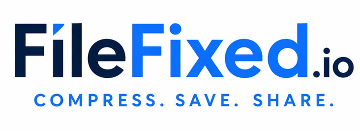
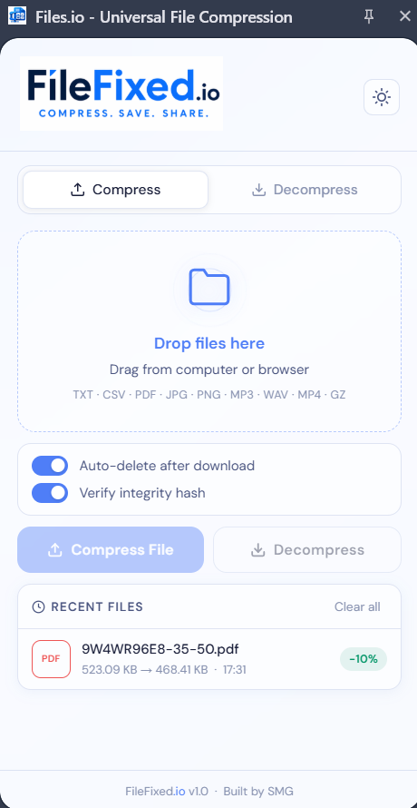

# FilesFixed.io — File fixed in single click


---

## Overview




**FilesFixed.io** is a fully browser-native Chrome Extension that compresses and decompresses files of multiple types — text, images, audio, and video — entirely offline, without any server-side processing. The extension opens as a **Side Panel** (Manifest V3) and supports both **lossless** compression (guaranteeing 100% data-identical rebuilds verified via SHA-256 hashing) and **lossy** compression (discarding perceptually imperceptible data for maximum size reduction). After every operation, it transparently reports performance metrics including compression ratio, space savings percentage, and perceptual quality scores (PSNR / SSIM) for lossy media. The UI features a premium dark/light-themed glassmorphism aesthetic with smooth state transitions and a recent-files history panel, and remains fully responsive even during heavy WebAssembly workloads via a dedicated background Service Worker.

---

## User Interface



---

## Results

| Format | Original Size | Compressed Size | Decompressed Size | Compression Ratio | Saved (%) | PSNR |
|---|---:|---:|---:|---:|---:|---:|
| Image (PNG — lossless) | 441 KB | 238 KB | 441 KB | 1.85:1 | 46.03% | N/A |
| Image (JPG — lossy) | 441 KB | 238 KB | 441 KB | 1.85:1 | 46.03% | 35.59 dB |
| Video (MP4) | 456.6 MB | 14.5 MB | 456.6 MB | 31.49:1 | 96.83% | N/A |
| PDF | 9.57 KB | 6.27 KB | 9.57 KB | 1.53:1 | 34.48% | N/A |
| MP3 / WAV | 7.85 MB | 3.62 MB | 7.85 MB | 2.17:1 | 53.89% | N/A |
| CSV / TXT | 18.15 KB | 3.5 KB | 18.15 KB | 5.19:1 | 80.72% | N/A |

---

## Team Members

| Team Member | Role | Key Files |
|---|---|---|
| **S** | Frontend & Audio Engine | `sidepanel.html`, `SidePanel.css`, `scripts/ui/SidePanelUI.js`, `audio-mp3.js` |
| **M** | Lossy Media Engine | `image-jpg.js`, `video-mp4.js` |
| **G** | Core DSA, Metrics & Lossless | `text-gz.js`, `image-png.js`, `metrics.js`, `crypto-hash.js` |

---

## Features

- **Multi-Format Compression** — Supports `.txt` / `.csv` (lossless gzip), `.pdf` (lossless), `.png` (lossless UPNG), `.jpg` / `.jpeg` (lossy JPEG), `.mp3` / `.wav` (lossy MP3), and `.mp4` (lossy H.264 via ffmpeg.wasm)
- **Bidirectional Processing** — Compress any supported file and download the output; re-upload compressed files to fully decompress them back to the original format
- **Live Metrics Dashboard** — Instantly displays Original Size, Compressed Size, Compression Ratio (e.g. `5.19:1`), and Space Savings % after every operation
- **Cryptographic Rebuild Verification** — For all lossless operations, automatically computes and compares SHA-256 hashes of the original and decompressed file to prove byte-for-byte identical reconstruction; toggled via the **Verify integrity hash** toggle
- **Perceptual Quality Assessment** — Calculates and displays PSNR (Peak Signal-to-Noise Ratio) and SSIM (Structural Similarity Index) scores for lossy image and video outputs
- **Video Compression Levels** — Choose between ⚡ **Fast** (larger file, quicker encode) and 💎 **Max** (smallest possible file) for MP4 processing
- **Asynchronous Background Processing** — Heavy WebAssembly tasks (ffmpeg video encoding) are offloaded to a Manifest V3 Service Worker, keeping the side panel UI fully responsive at all times
- **Metadata Embedding** — Original filename, size, algorithm, hash, and quality metrics are embedded alongside every compressed file for seamless one-click decompression
- **Recent Files History** — The side panel maintains a history of recently processed files with per-entry metrics, clearable with a single click
- **Auto-Delete Toggle** — Optionally clear file state automatically after download to keep the panel clean
- **Graceful Error Handling** — Unsupported formats, oversized files, and runtime failures surface as clear inline UI error messages rather than silent console failures
- **Glassmorphism UI** — Polished dark/light-themed interface with translucent backdrop filters, modern typography (DM Sans), and smooth state transitions

---

## Repository Structure

```text
FilesFixed.io/
├── manifest.json                        # Manifest V3 config
├── sidepanel.html                       # Extension side panel shell
├── SidePanel.css                        # Glassmorphism dark/light UI styles
├── MetaData_manager.js                  # Root-level metadata manager (legacy entry)
├── ProgressTracker.js                   # Root-level progress tracker (legacy entry)
├── background/
│   └── service-worker.js               # Offloads heavy WASM tasks to background
├── scripts/
│   ├── ui/
│   │   ├── SidePanelUI.js              # Dark mode, file preview, video options, history
│   │   └── SidePanelHandler.js         # DOM events & compression routing
│   ├── compressors/
│   │   ├── lossless/
│   │   │   ├── text-gz.js              # gzip via pako (TXT, CSV, PDF)
│   │   │   ├── image-png.js            # Lossless PNG via UPNG.js
│   │   │   └── document-pdf.js         # PDF lossless handling
│   │   └── lossy/
│   │       ├── image-jpg.js            # JPEG via jpeg-js (with PSNR)
│   │       ├── audio-mp3.js            # MP3/WAV via lamejs
│   │       └── video-mp4.js            # H.264 via ffmpeg.wasm (Fast/Max levels)
│   └── utils/
│       ├── metrics.js                  # Ratio, savings %, PSNR, SSIM
│       ├── crypto-hash.js              # SHA-256 via SubtleCrypto Web API
│       ├── file-reader.js              # Chunked FileReader pipeline
│       ├── MetaData_manager.js         # Metadata embed/extract/validate
│       └── ProgressTracker.js          # Progress bar & elapsed/remaining time
├── lib/
│   ├── pako.min.js                     # DEFLATE/gzip compression
│   ├── jpeg-js.min.js                  # JPEG encode/decode
│   ├── upng.min.js                     # Lossless PNG encode/decode
│   ├── lamejs.min.js                   # MP3 audio encoding
│   ├── pdf-lib.min.js                  # PDF manipulation
│   ├── ffmpeg.min.js                   # ffmpeg.wasm orchestration
│   ├── ffmpeg-core.js                  # ffmpeg WebAssembly core loader
│   └── ffmpeg-core.wasm                # ffmpeg WASM binary (~30 MB)
├── assets/
│   ├── filefixed-logo.png              # Extension icon (16/48/128 px)
│   └── Interface_filefixed.io.png      # UI screenshot
└── samples/
    ├── csv/                            # Sample CSV files for testing
    ├── jpgAndJpeg/                     # Sample JPEG images for testing
    ├── mp3AndWav/                      # Sample audio files for testing
    └── pdfAndText/                     # Sample PDF/text files for testing
```

---

## Installation

> **Requirements:** Google Chrome v88+ or any Chromium-based browser (Edge, Brave).

1. **Download the source** — Clone or download this repository as a `.zip` and extract it to a local folder.

   ```bash
   git clone https://github.com/GovindUpadhyay13/FilesFixed.io.git
   ```

2. **Open Chrome Extensions** — Navigate to `chrome://extensions` in your browser address bar.

3. **Enable Developer Mode** — Toggle the **Developer mode** switch in the top-right corner of the Extensions page.

4. **Load the extension** — Click **Load unpacked**, then select the root folder of this repository (the one containing `manifest.json`).

5. **Pin the extension** — Click the puzzle-piece icon in Chrome's toolbar, find **Files.io – Universal File Compression**, and click the pin icon so it is always visible.

6. **Open the side panel** — Click the FilesFixed.io icon in your toolbar. The extension opens as a **Side Panel** on the right side of your browser window.

> **Packaging as `.crx`:** To distribute as a packaged extension, go to `chrome://extensions`, click **Pack extension**, point it at the project root, and Chrome will generate a `.crx` file and a `.pem` private key.

---

## How to Use

### Compression

1. Click the FilesFixed.io icon to open the Side Panel.
2. Drag and drop a file onto the **Drop files here** zone, or click the zone to browse for a file.
   - Supported: `.txt`, `.csv`, `.pdf`, `.jpg`, `.jpeg`, `.png`, `.mp3`, `.wav`, `.mp4`, `.gz`
3. The extension auto-detects the file type and selects the appropriate algorithm.
4. *(MP4 only)* Choose a **Video compression level**: ⚡ **Fast** for a quick encode or 💎 **Max** for the smallest possible file.
5. Optionally toggle **Verify integrity hash** (on by default) to enable SHA-256 verification after decompression.
6. Click **Compress File**.
7. The metrics panel updates with Original Size, Compressed Size, Compression Ratio, and Space Savings %.
8. Click **Download Result** to save the compressed output.

### Decompression

1. Open the Side Panel and switch to the **Decompress** tab.
2. Drag or browse for the previously compressed file.
3. Click **Decompress**.
4. For lossless files (`.gz`, `.png`), a SHA-256 hash comparison is performed automatically — a ✅ confirms byte-for-byte identical reconstruction.
5. For lossy files (`.jpg`, `.mp3`, `.mp4`), PSNR and SSIM quality scores are displayed.
6. Click **Download Result** to save the restored file.

---

## Rebuild Verification

### Lossless Files (TXT, CSV, PDF, PNG)

After decompression, the extension automatically computes SHA-256 hashes of both the original and reconstructed file using the SubtleCrypto Web API and compares them. A matching hash pair proves byte-for-byte identical reconstruction with zero data loss.

```
Original SHA-256:     a3f1c...d9e2
Decompressed SHA-256: a3f1c...d9e2
Status: ✅ MATCH — Lossless rebuild verified
```

### Lossy Files (JPEG, MP3, MP4)

For lossy formats, perceptual quality metrics are calculated and displayed:

- **PSNR (Peak Signal-to-Noise Ratio)** — Values above **30 dB** are generally considered good quality; above **40 dB** is considered excellent.
- **SSIM (Structural Similarity Index)** — Values range from 0 to 1; scores above **0.95** indicate high perceptual fidelity.

---

## Algorithm Explanation

| Library | Format | Type | Why It Was Chosen |
|---|---|---|---|
| **pako** v2 | `.txt`, `.csv`, `.pdf` | Lossless | Pure-JS implementation of DEFLATE/gzip (RFC 1952). Fast, zero-dependency, runs natively in browser context without WASM overhead. |
| **UPNG.js** | `.png` | Lossless | Lightweight PNG encoder/decoder supporting full bit-depth and alpha channels. Outperforms Canvas `toBlob()` for programmatic control over filter heuristics. |
| **jpeg-js** | `.jpg`, `.jpeg` | Lossy | Pure-JS JPEG encoder/decoder. Allows direct control of the quantisation quality factor (0–100) for spatial redundancy reduction without native binaries. |
| **lamejs** | `.mp3`, `.wav` | Lossy | JavaScript port of the LAME MP3 encoder. Enables configurable bitrate MP3 encoding entirely in-browser via typed arrays. |
| **ffmpeg.wasm** | `.mp4` | Lossy | WebAssembly port of FFmpeg. The only viable path for H.264 video encoding in a browser environment; runs in the Service Worker to avoid UI thread blocking. |
| **pdf-lib** | `.pdf` | Lossless | Pure-JS PDF creation and modification library. Enables content-stream–level optimisations without relying on native PDF renderers. |
| **SubtleCrypto** | Hash | Utility | Built-in Web Crypto API — no external dependency needed for SHA-256 digest generation, ensuring zero attack surface for cryptographic operations. |

---

## Limitations

- **Maximum file size** — Very large video files (>100 MB) may exceed browser memory limits depending on available RAM. The chunked FileReader mitigates this but does not eliminate it entirely.
- **Video encoding speed** — ffmpeg.wasm encoding is significantly slower than native FFmpeg. A 30-second 1080p clip may take 1–3 minutes depending on hardware.
- **Unsupported sub-formats** — Animated GIFs, WebP, HEIC/HEIF images, OGG/FLAC audio, and AV1/HEVC video are not currently supported.
- **Browser compatibility** — Requires a Chromium-based browser (Chrome, Edge, Brave). Firefox and Safari are not supported due to Manifest V3 and WebAssembly `SharedArrayBuffer` differences.
- **Offline WASM load** — `ffmpeg-core.wasm` (~30 MB) must be fully loaded into memory before any video operation; first-run latency is expected.
- **No batch processing** — The current UI supports single-file operations only; batch/folder compression is not implemented.
- **Side Panel only** — The extension opens exclusively as a Chrome Side Panel and does not support the traditional popup mode.

---

## Changes to be made 
- Adding file conversion to thw sidepanel , so user can convert his files directly using this extension .
- Video compression - improve the friction in fast and max modes .

### Libraries
- [pako](https://github.com/nodeca/pako) — High-speed zlib port to JavaScript
- [UPNG.js](https://github.com/photopea/UPNG.js) — Fast, advanced PNG encoder/decoder
- [jpeg-js](https://github.com/jpeg-js/jpeg-js) — Pure JavaScript JPEG encoder/decoder
- [lamejs](https://github.com/zhuker/lamejs) — MP3 encoder in JavaScript
- [ffmpeg.wasm](https://github.com/ffmpegwasm/ffmpeg.wasm) — FFmpeg compiled to WebAssembly
- [pdf-lib](https://github.com/Hopding/pdf-lib) — Create and modify PDF documents in any JavaScript environment

### Standards & APIs
- [RFC 1952 — GZIP File Format Specification](https://www.ietf.org/rfc/rfc1952.txt)
- [Web Crypto API — SubtleCrypto](https://developer.mozilla.org/en-US/docs/Web/API/SubtleCrypto)
- [FileReader API — MDN](https://developer.mozilla.org/en-US/docs/Web/API/FileReader)
- [Chrome Extensions — Manifest V3 Overview](https://developer.chrome.com/docs/extensions/mv3/intro/)
- [Chrome Side Panel API](https://developer.chrome.com/docs/extensions/reference/sidePanel/)
- [Service Workers — MDN](https://developer.mozilla.org/en-US/docs/Web/API/Service_Worker_API)

### Concepts & Articles
- [PSNR and SSIM for Image Quality Assessment](https://en.wikipedia.org/wiki/Peak_signal-to-noise_ratio)
- [SSIM — Structural Similarity Index](https://en.wikipedia.org/wiki/Structural_similarity)
- [JPEG Compression & the DCT](https://www.sciencedirect.com/topics/engineering/discrete-cosine-transform)
